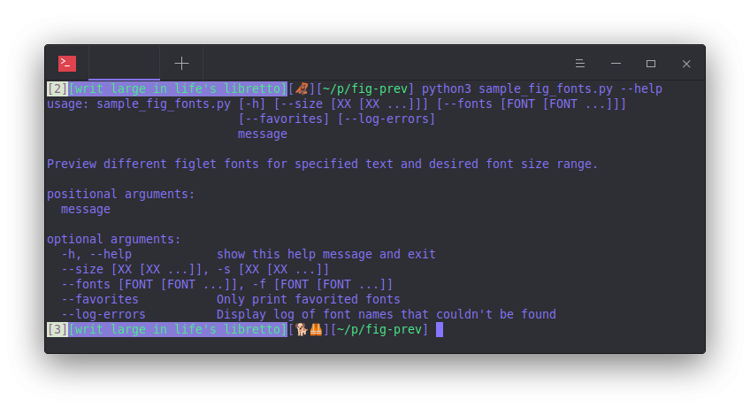
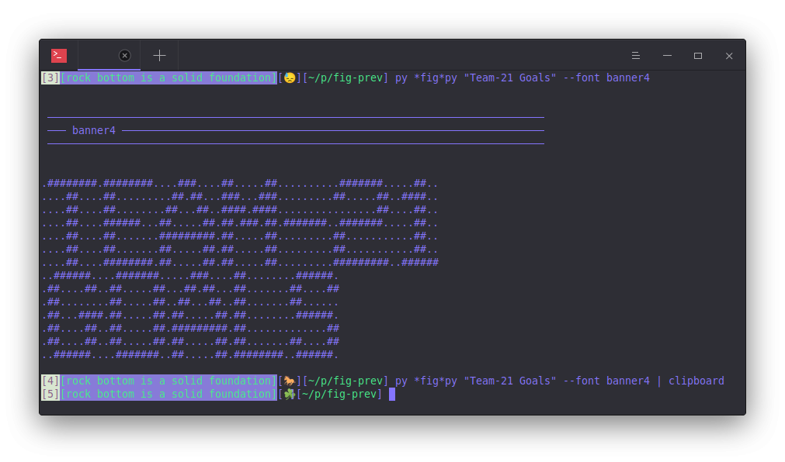
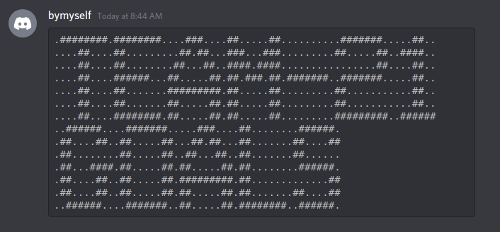
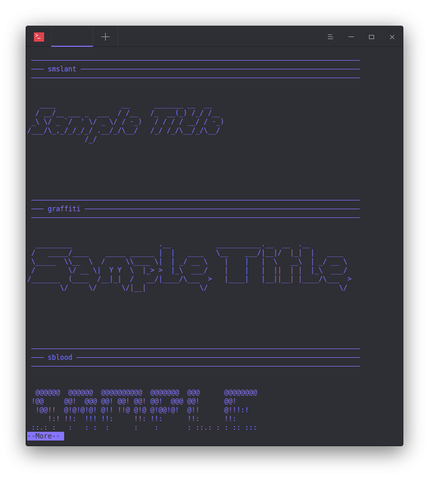

# Preview Figlet Fonts

*Cross-system script to browse FIGlet fonts applied to given text*
- Flair text for titles/headings in Discord, email, texts, forums, Reddit, etc.
- Provide a message and a size (s, m, l, etc.) and get a collection of marked up headers

--------------

**Table of Contents**

<!-- TOC -->

- [Usage](#usage)
    - [Install Requirements](#install-requirements)
    - [Use at a terminal](#use-at-a-terminal)
    - [Make your Choice](#make-your-choice)
    - [Optional](#optional)
            - [pipe output to more or less](#pipe-output-to-more-or-less)
            - [create an alias](#create-an-alias)
- [Requirements](#requirements)
- [References](#references)

<!-- /TOC -->

## Usage

#### Install [Requirements](#requirements)

```bash
# Unix/macOS
python3 -m pip install -r requirements.txt

# Windows
py -m pip install -r requirements.txt
```

#### Use at a terminal

```bash
# Unix/macOS
python3 sample_fig_fonts.py --help

# Windows
py sample_fig_fonts.py --help
```




#### Make your Choice

- Choose your font then copy and paste output
  - If you don't want to scroll forever, start script again with `--font <FONT>` option to re-print at bottom of terminal



- Paste to Discord, forum, reddit, digital classroom, email, etc.




#### Optional 

###### pipe output to `more` or `less`

```bash
# Unix
python3 sample_fig_fonts.py <message> [options] | more

# Windows
py sample_fig_fonts.py <message> [options] | more
```



###### create an alias

*Unix*: Either move the `fig.sh` script to login directory, and `chmod +x ~/fig.sh` or set an alias in your .bashrc that does the same thing as the commands in that script.

*Windows*: Move `fig.bat` script to login directory, then use script by just typing `fig <message> [options]` in cmd


## Requirements

- [pyfiglet](https://pypi.org/project/pyfiglet/0.7/)
- [argparse](https://docs.python.org/3/library/argparse.html)

## References

- [Figlet](https://en.wikipedia.org/wiki/FIGlet)

> FIGlet is a computer program that generates text banners, in a variety of typefaces, composed of letters made up of conglomerations of smaller ASCII characters (see ASCII art). The name derives from "Frank, Ian and Glenn's letters".[4]
>
> Being free software, FIGlet is commonly included as part of many Unix-like operating systems (Linux,[5] BSD, etc.) distributions, but it has been ported to other platforms as well. 

-----------

This is just a script that took an hour. The readme is long because it is helpful to others. But all credit to developers of the dependencies. Thank you to everyone who has developed the figlet code, and amazing fonts, and for providing them for free. God bless!
